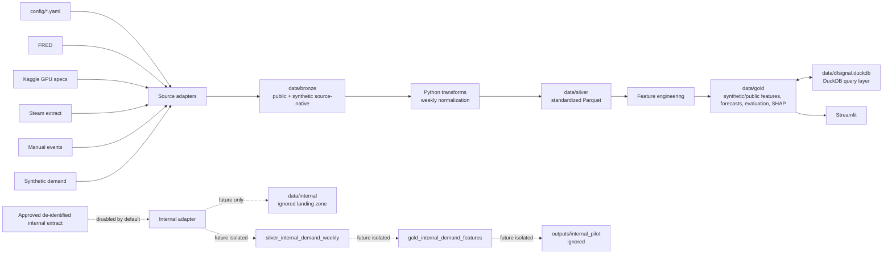

# DFSignal Local Medallion Architecture

## Current mode

`LOCAL_DEV` only: Python, local filesystem, Parquet, and DuckDB. No Fabric,
Azure, cloud storage, Power BI, or company infrastructure is required.

## Flow

## Storage abstraction

`StorageBackend` defines `read_table`, `write_table`, `table_exists`, and
`metadata`. `LocalStorageBackend` stores Parquet under `data/{bronze,silver,gold}`
and exposes DuckDB as the local query layer. Core transformations receive a
backend instance; they do not construct absolute paths or call `read_parquet`
directly.

A future Fabric backend can implement the same interface using OneLake/Delta,
Lakehouse files, or Warehouse SQL while leaving feature engineering and models
unchanged.

## Table contracts

| Layer | Logical tables | Grain |
|---|---|---|
| Bronze | `fred`, `gpu_specs`, `steam_hardware`, `launch_events`, `internal_demand` | source-native rows |
| Silver | `macro_weekly`, `gpu_product`, `gpu_event`, `hardware_weekly`, `internal_demand_weekly` | normalized source rows |
| Future internal | `silver_internal_demand_weekly` | configured weekly internal grain |
| Gold | `demand_features`, `forecast`, `model_performance`, `forecast_drivers` | model or forecast grain |
| Future internal | `gold_internal_demand_features` | configured weekly internal grain |

Future internal objects are additive and must not overwrite synthetic tables or
outputs. Internal landing and pilot output paths are fully gitignored.

## Design rules

- Parquet is the primary persisted analytical format; DuckDB is the query layer.
- Python owns reusable transformations; SQL is limited to storage/query operations.
- Source configuration is registry-driven and external URLs are never embedded in
  modeling code.
- Synthetic records carry `source_id: SYNTHETIC` and are never presented as real
  business findings.
- Critical schema/date/key validation fails loudly.
