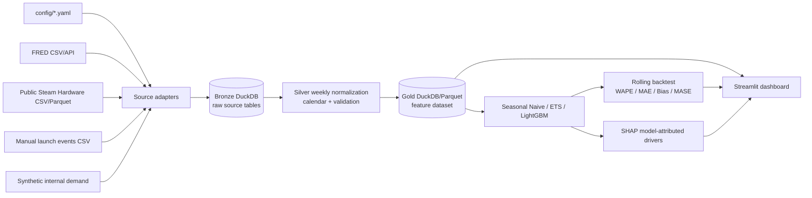

# Phase 1 Design

## Objective

Demonstrate that external public signals can be normalized to a weekly calendar,
joined to clearly labelled synthetic internal demand, and evaluated against
history-only baselines without claiming causal impact.

## Scope

Phase 1 uses one modeling slice: `Memory / PC Components`, global region, and a
single synthetic demand series. It supports configurable FRED series, a
configurable public Steam Hardware Survey file, and manually maintained hardware
launch events. All other sources and business families remain extension points.

## Architecture



## Proposed repository structure

```text
config/
  sources.yaml                 # source registry and execution mode
  fred.yaml                    # enabled FRED series
  google_trends.yaml           # reserved for Phase 2
  entities.yaml                # reserved for news intelligence
  product_signal_mapping.yaml # business-family mapping
  news_decay.yaml              # reserved for news layer
  models.yaml                  # model/backtest settings
  features.yaml                # feature and lag settings

data/raw/                      # downloaded source files, ignored
 data/processed/               # normalized files, ignored
src/dfsignal/
  app.py                       # Streamlit dashboard
  pipeline.py                  # end-to-end Phase 1 orchestration
  config.py                    # typed YAML/environment configuration
  storage.py                   # DuckDB schema and persistence
  ingestion/                   # FRED, Steam, events, synthetic demand adapters
  transformation/              # weekly calendar and normalized signals
  features/                    # demand and external feature assembly
  forecasting/                 # Seasonal Naive, ETS, LightGBM
  evaluation/                  # rolling backtest and metrics
  explainability/              # SHAP drivers
  utils/                       # logging and retry helpers
tests/
  fixtures/                    # tiny public-shape/sample fixtures only
docs/
  PHASE1_DESIGN.md
  ARCHITECTURE.md
  TASKS.md
```

## DuckDB schema proposal

DuckDB is the local analytical store. Tables are created idempotently by
`storage.initialize_schema()`.

### Bronze

- `bronze_fred(observation_date DATE, series_id VARCHAR, value DOUBLE, source_url VARCHAR, loaded_at TIMESTAMP, raw_payload_hash VARCHAR)`
- `bronze_steam_hardware(observation_date DATE, metric_name VARCHAR, metric_value DOUBLE, source VARCHAR, loaded_at TIMESTAMP)`
- `bronze_launch_events(event_date DATE, event_type VARCHAR, vendor VARCHAR, product_family VARCHAR, product_name VARCHAR, generation VARCHAR, source VARCHAR, confidence DOUBLE, loaded_at TIMESTAMP)`
- `bronze_internal_demand(week DATE, business_segment VARCHAR, product_group VARCHAR, product_family VARCHAR, region VARCHAR, channel VARCHAR, pos_qty DOUBLE, pos_revenue DOUBLE, shipment_qty DOUBLE, shipment_revenue DOUBLE, booking_qty DOUBLE, booking_revenue DOUBLE, asp DOUBLE, inventory_qty DOUBLE, source_id VARCHAR, source_as_of TIMESTAMP, loaded_at TIMESTAMP, file_hash VARCHAR)`

### Silver

- `silver_macro_weekly(week DATE, feature_name VARCHAR, feature_value DOUBLE, source VARCHAR, source_as_of DATE, loaded_at TIMESTAMP)`
- `silver_hardware_weekly(week DATE, feature_name VARCHAR, feature_value DOUBLE, source VARCHAR, source_as_of DATE, loaded_at TIMESTAMP)`
- `silver_events(week DATE, feature_name VARCHAR, feature_value DOUBLE, event_date DATE, source VARCHAR, loaded_at TIMESTAMP)`
- `silver_internal_demand_weekly(week DATE, business_segment VARCHAR, product_group VARCHAR, product_family VARCHAR, region VARCHAR, channel VARCHAR, pos_qty DOUBLE, pos_revenue DOUBLE, shipment_qty DOUBLE, shipment_revenue DOUBLE, booking_qty DOUBLE, booking_revenue DOUBLE, asp DOUBLE, inventory_qty DOUBLE, source_id VARCHAR, source_as_of TIMESTAMP, loaded_at TIMESTAMP, file_hash VARCHAR)`


The internal-demand rows above describe the future isolated adapter contract;
they are not created by the current synthetic/public pipeline. See
`docs/internal_data_contract.md` for mapping, validation, de-identification,
and Git-safety rules.

### Gold

- `fact_demand_feature(week DATE, region VARCHAR, business_family VARCHAR, actual_demand DOUBLE, feature_name VARCHAR, feature_value DOUBLE, source VARCHAR, loaded_at TIMESTAMP)`
- `fact_model_training(week DATE, business_family VARCHAR, target DOUBLE, feature_json JSON, split VARCHAR, loaded_at TIMESTAMP)`
- `fact_forecast(week DATE, business_family VARCHAR, horizon_weeks INTEGER, model_name VARCHAR, point_forecast DOUBLE, lower_bound DOUBLE, upper_bound DOUBLE, created_at TIMESTAMP)`
- `fact_model_performance(model_name VARCHAR, cutoff_week DATE, horizon_weeks INTEGER, wape DOUBLE, mae DOUBLE, bias DOUBLE, mase DOUBLE, rmse DOUBLE, created_at TIMESTAMP)`

## Feature schema

One row per `week x region x business_family`:

- Target: `actual_demand`
- External: configured FRED features, `steam_gpu_adoption`, `steam_ram_32gb_plus_share`
- Events: `gpu_launch_score`, `cpu_launch_score`, `launch_plus_4_weeks`, `launch_plus_13_weeks`
- Calendar: `week_of_year`, `month`, `quarter`, `black_friday`, `cyber_monday`, `christmas`, `back_to_school`
- Generated target features: lags 1/2/4/8/13/26/52, rolling means 4/8/13/26/52, rolling std 4/13, WoW, YoY, 4-week and 13-week momentum

Features are computed using only rows at or before the prediction cutoff. Any
future-known calendar or event feature must be explicitly marked as known in
advance; target-derived rolling windows are shifted before use.

## Model and backtest design

1. Seasonal Naive: same week-of-year from the prior available year.
2. ETS: additive trend/seasonality where sufficient history exists.
3. LightGBM: deterministic regression model over calendar, external, event, and
   lag features. No deep learning or CatBoost in Phase 1.
4. Rolling-origin evaluation: expanding training windows and fixed forecast
   horizons of 4, 8, 13, and 26 weeks. No random split.
5. Metrics: WAPE, MAE, signed Bias, MASE, RMSE, and directional accuracy where defined.
6. FVA: compare each model against Seasonal Naive at the same cutoff/horizon.
7. SHAP: TreeExplainer output for LightGBM only. Report as model-attributed
   influence, never causal effect.

The executable PoC will use a small local date range by default for fast smoke
runs. The configured historical target is 2016-01-01 through current date.
